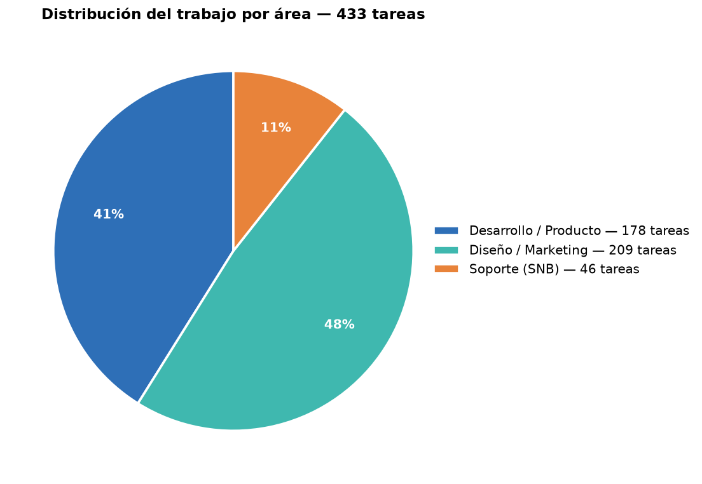
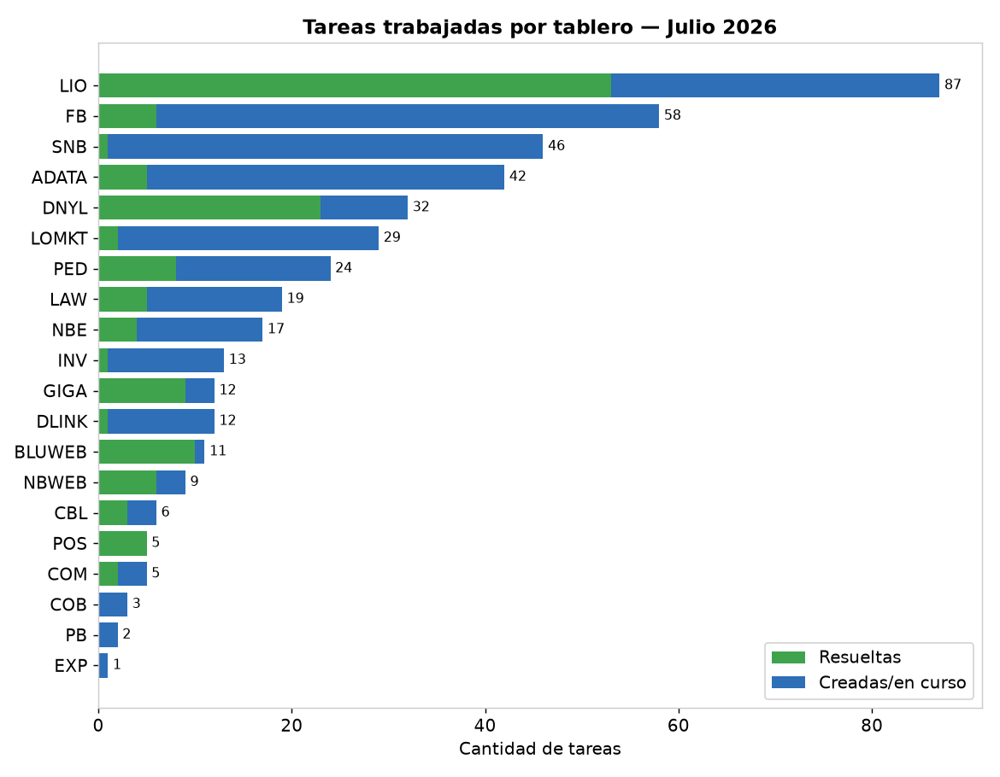
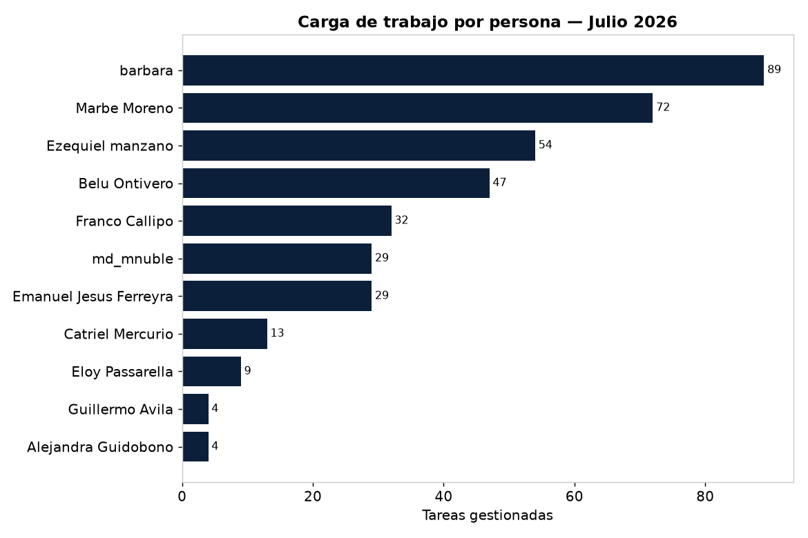
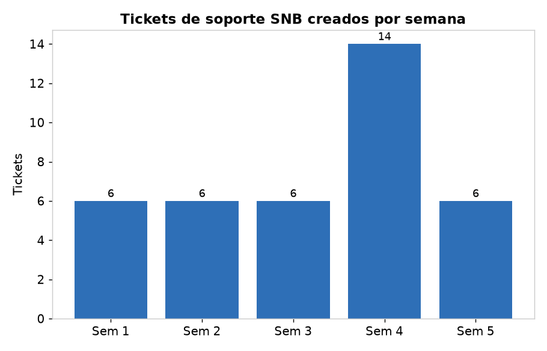
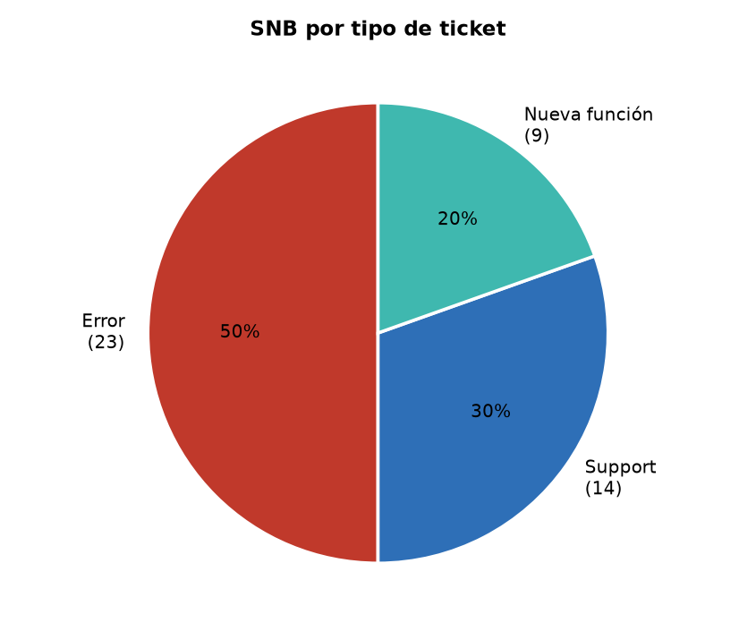
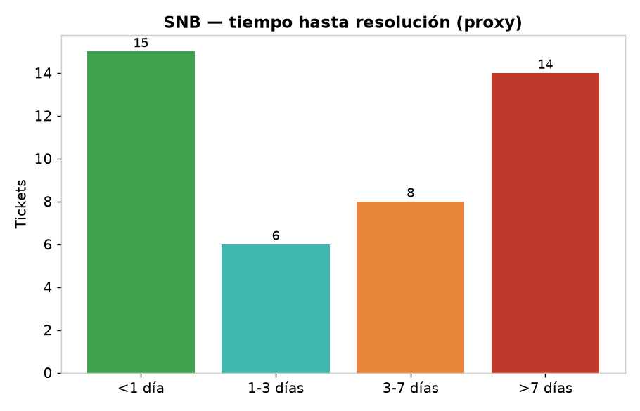
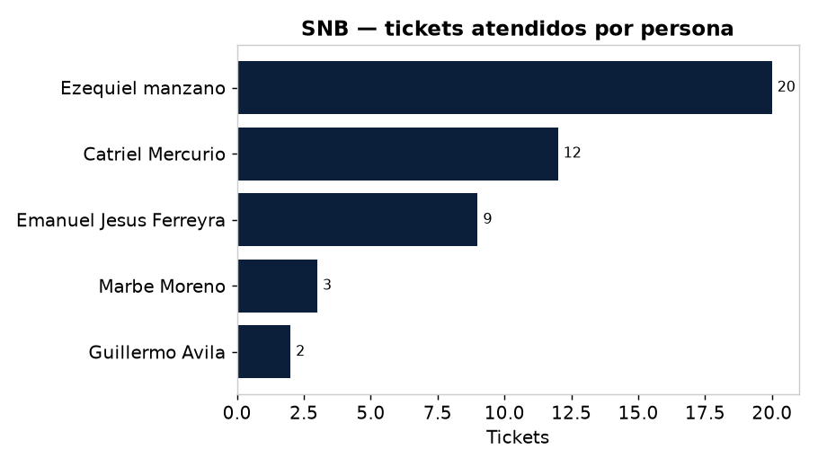

# 📈 Reporte Detallado — Julio 2026
### Trabajo por empresa/tablero · Gestión de RRHH · Impacto del Soporte (SNB)

**Período:** 1–31 julio 2026 · **Fuente:** Jira (todos los tableros) · **Generado:** 2026-08-12

> Complementa el resumen ejecutivo en [[2026-07-reporte-junta|Reporte Junta – Julio 2026]].

---

## 1. Panorama del mes

| Métrica | Valor |
|---|---|
| 🗂️ Tareas **trabajadas** (creadas o movidas) | **433** |
| 🆕 Creadas en julio | 299 |
| ✅ Completadas en julio | 144 |
| 🎧 Tickets de **soporte** (SNB) | 46 |
| 👥 Personas involucradas | 12 |
| 📋 Tableros con actividad | 19 |

**Lectura:** el 48% del esfuerzo fue Diseño/Marketing (209 tareas), el 41% Desarrollo/Producto (178) y el 11% Soporte (46). Se cerraron 144 entregables pero ingresaron 299 nuevos: **el backlog creció ~2:1**, señal de fuerte demanda (arranque de GIGA, sistema de reputación de LIO, catálogo A+).

---

## 2. Gestión del recurso humano

Cómo se distribuyó la carga entre el equipo durante julio:

| Persona | Tareas | Foco principal |
|---|---|---|
| **Bárbara** | 89 | Diseño/activaciones (ADATA, FB, LASET, marcas) + carga al ERP |
| **Marbe Moreno** | 72 | Front LIO + catálogo A+ (Gigabyte/Trust) + web NB |
| **Ezequiel Manzano** | 54 | Backend LIO/Pedidos/Postventa + ERP GIGA + soporte |
| **Belu Ontivero** | 47 | Diseño Blu/LASET/FB (triadas, redes, obra) |
| **Franco Callipo** | 32 | Backend LIO — reputación/calificaciones (API+CMS) |
| **Emanuel Ferreyra** | 29 | Backend Pedidos/Billetera LO |
| **Manu (Diseño NB)** | 29 | Diseño NB — ingresos de marca, promos, kits |
| **Catriel** | 13 | Dirección + gestión de soporte |
| Eloy, Guillermo, Alejandra | 17 | QA/research/eventos |

> **Observación de gestión:** el equipo de diseño (Bárbara + Belu + Manu ≈ 165 tareas) sostuvo el mayor volumen operativo, mientras que el núcleo de desarrollo (Eze + Franco + Ema ≈ 115) concentró la complejidad técnica. Ezequiel fue el recurso más demandado por trabajar en **3 frentes en paralelo** (Pedidos/Postventa, ERP GIGA y soporte SNB).

---

## 3. 🎧 Impacto del Soporte (SNB)

El soporte transversal absorbió **46 tickets** en el mes, con **43 resueltos (93%)**.

- **Composición:** 23 Errores (50%), 14 consultas de Support (30%), 9 Nuevas funciones (20%). Es decir, **la mitad fueron incidencias/bugs** que interrumpieron el trabajo planificado.
- **Estacionalidad:** pico en la **semana 4** (14 tickets), más del doble de una semana normal (~6).

### Impacto de tiempo
Sobre los 43 tickets resueltos (proxy creación→última actualización):

| Métrica | Valor |
|---|---|
| Tiempo de resolución **promedio** | **5,6 días** |
| Tiempo de resolución **mediano** | **3,7 días** |
| Resueltos en **< 1 día** | 15 (35%) |
| Resueltos en **> 7 días** | 14 (33%) |
| Esfuerzo estimado del equipo* | **~35–46 hs (≈ 4–6 jornadas)** |

\* Estimación a 45–60 min de atención efectiva por ticket (no hay worklogs cargados; el tiempo calendario incluye esperas).

### Quién sostuvo el soporte
- **Ezequiel Manzano — 20 tickets** (43%): el soporte le consumió una porción equivalente a todo su trabajo del ERP GIGA del mes.
- **Catriel — 12** · **Emanuel — 9** · Marbe 3 · Guillermo 2.

> **Conclusión de gestión:** el soporte **no es gratis**: recae sobre el mismo equipo de desarrollo (Eze/Ema) y compite con el roadmap. Con 46 tickets/mes y ~1/3 tardando más de una semana, conviene evaluar (a) un primer nivel de soporte dedicado, y (b) atacar las causas raíz de los Errores recurrentes (50% de los tickets) para liberar capacidad de desarrollo.

---

## 4. Detalle tablero por tablero

**Referencias:** 🆕 creada en julio · ✅ completada · 🔄 en curso · ⏳ por hacer.

## 🛒 Libre Opción — 116 tareas

#### LIO — LIO
**87 tareas** · 🆕 70 nuevas · ✅ 54 completadas · 🔄 24 en curso

- ⏳ `LIO-679` · *Backlog* · Marbe Moreno — Opiniones de producto
- 🆕⏳ `LIO-736` · *Backlog* · — — APP - API - OM - agregar cantidad de opiniones tipo: google maps o meli
- 🆕⏳ `LIO-737` · *Backlog* · — — A+ Content 2
- 🆕⏳ `LIO-742` · *Backlog* · — — PartPicker
- 🆕⏳ `LIO-764` · *Backlog* · Franco Callipo — Instalar en local el juego Shopping Goblin
- 🆕⏳ `LIO-765` · *Backlog* · Franco Callipo — Agregar multiplicador de puntos configurable por .env
- 🆕⏳ `LIO-766` · *Backlog* · Franco Callipo — Al finalizar el juego, permitir enviar un correo al mail ingresado
- 🆕⏳ `LIO-767` · *Backlog* · Franco Callipo — Coordinar con la feature de air-drop de Ema para canjear los puntos del juego (sin acumular)
- 🔄 `LIO-666` · *En curso* · Franco Callipo — APP - Feat - Un vendedor debe poder pedir la revision para poder quitar una calificacion
- 🆕🔄 `LIO-709` · *En curso* · Marbe Moreno — Tiendas oficiales
- 🆕🔄 `LIO-754` · *En curso* · Emanuel Jesus Ferreyra — APP Mobile - Review - Control de versión -> Diferencia de versiones
- ✅ `LIO-645` · *Finalizada* · Marbe Moreno — A+ Content
- ✅ `LIO-678` · *Finalizada* · Franco Callipo — API - CMS - Feat - Calificaciones del vendedor
- ✅ `LIO-680` · *Finalizada* · Marbe Moreno — APP - Crear pantalla de calificación de producto (Similar a la calificación del vendedor)
- ✅ `LIO-681` · *Finalizada* · Franco Callipo — API - feat - Crear endpoint de tipo PATCH para opinión del producto
- ✅ `LIO-682` · *Finalizada* · Franco Callipo — API - Refactor - Ajustar las calificaciones del producto para mostrarla en la ficha
- ✅ `LIO-683` · *Finalizada* · Marbe Moreno — APP - Refactor  - Modificar la pantalla de calificacion de vendedor
- ✅ `LIO-685` · *Finalizada* · Marbe Moreno — APP - Feat - Penales
- ✅ `LIO-686` · *Finalizada* · Ezequiel manzano — API - Feat - Penales
- ✅ `LIO-687` · *Finalizada* · Franco Callipo — API - Refactor - Recursos para calificar un vendedor segun una compra
- ✅ `LIO-689` · *Finalizada* · Franco Callipo — API - LO - Refactor - Ver calificaciones con las observaciones del admin del CMS
- ✅ `LIO-690` · *Finalizada* · Marbe Moreno — APP - Feat - Agregar opcion de replicar y responder una calificacion dentro de la pantalla de Reputación del vendedor
- ✅ `LIO-691` · *Finalizada* · Franco Callipo — API - Refactor - Crear GET para traer el producto en la compra
- ✅ `LIO-702` · *Finalizada* · Marbe Moreno — APP - Agregar filtro al pricesuggestion 
- ✅ `LIO-706` · *Finalizada* · Marbe Moreno — APP - Envios - Feat - Cotización - Priorizar estadísticas reales en plazo de entrega y sugerido
- 🆕✅ `LIO-707` · *Finalizada* · Franco Callipo — API -Refactor - Ajustes para cuando se ve la reputacion de un vendedor
- 🆕✅ `LIO-710` · *Finalizada* · Franco Callipo — API - Review - Crear endpoint de tipo PATCH para opinión del producto -> Error sql al duplicar reseña
- 🆕✅ `LIO-711` · *Finalizada* · Franco Callipo — API - Review - Crear GET para traer el producto en la compra -> Homologar estructura de respuesta
- 🆕✅ `LIO-712` · *Finalizada* · Marbe Moreno — APP - LO - Feat - Ver calificaciones con las observaciones del admin del CMS
- 🆕✅ `LIO-714` · *Finalizada* · Franco Callipo — API - Refactor - Agregar key de calificación en la compra
- 🆕✅ `LIO-715` · *Finalizada* · Franco Callipo — API - Review Error al opinar
- 🆕✅ `LIO-716` · *Finalizada* · Franco Callipo — API - Fix - Traer calificación una vez opinado
- 🆕✅ `LIO-717` · *Finalizada* · Franco Callipo — API - Feature - Traer opinion hecha del cliente en el producto del lado de LO
- 🆕✅ `LIO-722` · *Finalizada* · Franco Callipo — API - Review - Traer calificación una vez opinado -> Calificación heredada entre compras
- 🆕✅ `LIO-726` · *Finalizada* · Marbe Moreno — APP - Feat - Maquetar pantalla de aterrizaje y redireccion - Mostrar los datos en la wallet
- 🆕✅ `LIO-729` · *Finalizada* · Ezequiel manzano — API - Refactor: Al guardar un puntaje, conservar siempre el puntaje más alto asociado a un mismo correo electrónico (un correo solo figura en el ranking una vez)
- 🆕✅ `LIO-731` · *Finalizada* · Marbe Moreno — APP - Refactor - Marcador suele verse siempre desplazado fuera de pantalla. Se puede mover a otro lado o quitar directamente ya que es facil llevar el recuento o se puede poner mas sutil con texto
- 🆕✅ `LIO-732` · *Finalizada* · Marbe Moreno — APP - Refactor - Intentar sacar del fondo contenido con cpyright sin cambiar proporciones para que el juego no se desajuste
- 🆕✅ `LIO-733` · *Finalizada* · Franco Callipo — API - Review - Traer calificación una vez opinado -> Calificación realizada no visible
- 🆕✅ `LIO-734` · *Finalizada* · Marbe Moreno — APP - Review - Pantalla de calificacion del vendedor -> Petición ejecutada automáticamente
- 🆕✅ `LIO-735` · *Finalizada* · Franco Callipo — API - Review - Calificar vendedor -> Campo obligatorio type
- 🆕✅ `LIO-738` · *Finalizada* · Marbe Moreno — APP - Elabrorar content A+ de Trust Carus GXT492W
- 🆕✅ `LIO-739` · *Finalizada* · Marbe Moreno — APP - Elaborar contetn A+ de Auricular Trust Carus Multiplataforma White Gxt492w
- 🆕✅ `LIO-740` · *Finalizada* · Marbe Moreno — APP - Elaborar content A+ de Trust Forta Ps5 Gxt498
- 🆕✅ `LIO-741` · *Finalizada* · Marbe Moreno — APP - Elaborar content A+ de Trust Gxt255
- 🆕✅ `LIO-743` · *Finalizada* · Ezequiel manzano — API - Refactor - Agregar login al partpicker de inventario
- 🆕✅ `LIO-744` · *Finalizada* · Marbe Moreno — APP - Elaborar contetn A_ de B840M A ELITE WIFI6E 1.0
- 🆕✅ `LIO-745` · *Finalizada* · Marbe Moreno — APP - Elaborar contet A+ B550 AORUS ELITE V2
- 🆕✅ `LIO-746` · *Finalizada* · Marbe Moreno — APP - Elaborar content A+ AORUS WATERFORCE X II 240
- 🆕✅ `LIO-747` · *Finalizada* · Marbe Moreno — APP - Elaborar content A+ B550I AORUS PRO AX
- 🆕✅ `LIO-748` · *Finalizada* · Emanuel Jesus Ferreyra — Revisar Google Play Console: actualizar target API de la app "Libre Opción Vendedores"
- 🆕✅ `LIO-749` · *Finalizada* · Marbe Moreno — Elaborar content A+ de Gigabyte Notebook i7-13620H 16GB DDR5 RTX 5050 512GB 16" FHD Win 11H
- 🆕✅ `LIO-750` · *Finalizada* · Marbe Moreno — Elaborar content A+ de Monitor Gamer Gigabyte 27" GS27FA SA
- 🆕✅ `LIO-751` · *Finalizada* · Marbe Moreno — Elaborar content A+ de Monitor Gamer Gigabyte 24.5" GS25F2 200Hz
- 🆕✅ `LIO-752` · *Finalizada* · Marbe Moreno — Elaborar content A+ de Fuente Gamer Gigabyte 550W Ice 80 Plus Silver ATX 3.0 White
- 🆕✅ `LIO-753` · *Finalizada* · Marbe Moreno — Elaborar content A+ de Motherboard Gigabyte AM4 A520M K V2
- 🆕✅ `LIO-755` · *Finalizada* · Marbe Moreno — Elaborar content A+ de Fuente Gamer Gigabyte 750W 80 V2 Gold Modular
- 🆕✅ `LIO-756` · *Finalizada* · Marbe Moreno — Elaborar content A+ de Fuente Gamer Gigabyte 850W 80 Gold Modular PG5 V2
- 🆕✅ `LIO-757` · *Finalizada* · Marbe Moreno — Elaborar content A+ de Fuente Gamer Gigabyte 750W 80 Bronze
- 🆕✅ `LIO-758` · *Finalizada* · Marbe Moreno — Elaborar content A+ de Placa de Video Gigabyte RTX 5050 WF OC 8GB
- 🆕✅ `LIO-759` · *Finalizada* · Marbe Moreno — Elaborar content A+ de Motherboard Gigabyte AMD AM5 X870E A Elite X Ice
- 🆕✅ `LIO-760` · *Finalizada* · Marbe Moreno — Elaborar content A+ de Gabinete Gamer Gigabyte C103 Glass PSU Bundle 650W 80 Gold
- 🆕✅ `LIO-761` · *Finalizada* · Marbe Moreno — Elaborar content A+ de Motherboard Gigabyte AM5 B840M Aorus Elite WiFi6E
- 🆕✅ `LIO-762` · *Finalizada* · Franco Callipo — Item aparece con marca "genérica" en la ficha y en el listado (Motherboard Gigabyte X870E A Elite X Ice)
- 🆕✅ `LIO-763` · *Finalizada* · Marbe Moreno — APP - Review - Mejorar como se ve una linea extraña en la home modo desktop-> ver img adjunta
- 🆕🔄 `LIO-708` · *Ready for QA* · Franco Callipo — API - CMS - Feat - Sección para cargar info de las tiendas oficiales (punto 1)
- 🆕🔄 `LIO-713` · *Ready for QA* · Franco Callipo — API - CMS - Review - Revisar si se notifica al vendedor cuando se "elimina" una calificación y que esta no afecte su ranking
- 🆕🔄 `LIO-718` · *Ready for QA* · Marbe Moreno — APP - Research maquetacion para busqueda de productos
- 🆕🔄 `LIO-719` · *Ready for QA* · Marbe Moreno — APP - Maquetacion de las busquedas
- 🆕🔄 `LIO-720` · *Ready for QA* · Franco Callipo — API - LO - Feat - Traer la información cargada en el CMS de las tiendas oficiales (punto 2)
- 🆕🔄 `LIO-721` · *Ready for QA* · Marbe Moreno — APP - Feat - Crear landing para AMD
- 🆕🔄 `LIO-723` · *Ready for QA* · Emanuel Jesus Ferreyra — API - Feat - Cancelación de retiro pendiente en la Wallet
- 🆕✅ `LIO-724` · *Ready for QA* · Emanuel Jesus Ferreyra — air drop -> Qr - En la Wallet
- 🆕🔄 `LIO-725` · *Ready for QA* · Emanuel Jesus Ferreyra — API - Modelado - Requerimientos
- 🆕🔄 `LIO-727` · *Ready for QA* · Marbe Moreno — APP - CMS - Feat - Seccion para cargar info de las tiendas oficiales (punto 1)
- 🆕🔄 `LIO-728` · *Ready for QA* · Emanuel Jesus Ferreyra — APP - Feat  - Cancelar retiro pendiente + monto máximo en la wallet
- 🆕🔄 `LIO-730` · *Ready for QA* · Marbe Moreno — APP - Refactor - Implementar mensajes de error en funcion de la respeusta nueva del backend
- 🆕🔄 `LIO-768` · *Ready for QA* · Franco Callipo — API - CMS - Actualización - Hacer la lógica para las secciones y los menues en la devolución del json de las tiendas oficiales
- 🆕🔄 `LIO-769` · *Ready for QA* · Franco Callipo — APP - LO - Agregar en la tienda oficial la parte de secciones y de los menues que trae ahora el endpoint
- 🆕🔄 `LIO-770` · *Ready for QA* · Franco Callipo — API - CMS - Asignar tienda oficial a vendedor
- 🆕🔄 `LIO-771` · *Ready for QA* · Franco Callipo — API - LO - Catálogo  del usuario (vendedor)-> tienda oficial 
- 🆕🔄 `LIO-772` · *Ready for QA* · Franco Callipo — API - Feat - Agregar campo de tienda oficial a los productos en las busquedas
- 🆕🔄 `LIO-773` · *Ready for QA* · Marbe Moreno — APP - Feat - Catálogo de productos -> Tienda oficial
- 🆕🔄 `LIO-774` · *Ready for QA* · Franco Callipo — API - Feat - Agregar subtitle (descripcion extra del producto)
- 🆕🔄 `LIO-775` · *Ready for QA* · Marbe Moreno — APP - CMS - Asignar tienda oficial a un vendedor
- 🆕🔄 `LIO-776` · *Ready for QA* · Franco Callipo — API - Feat - Modificar nombre de usuario vendedor por tienda oficial en LO 
- ⏳ `LIO-1` · *Selected for Development* · — — Experiencia del Usuario (UX)

#### LOMKT — LO | Marketing
**29 tareas** · 🆕 19 nuevas · ✅ 2 completadas · 🔄 25 en curso

- 🔄 `LOMKT-267` · *Activaciones OK* · barbara — 1.Jul: 04/07 Sabias que si no cambias la pasta térmica o grasa siliconada de tu procesador cada 6 meses tu pc deja de rendir al máximo nivel?
- 🔄 `LOMKT-268` · *Activaciones OK* · barbara — 3.Jul: 09/09 Pasta térmica + grasa siliconada
- 🔄 `LOMKT-269` · *Activaciones OK* · — — 2.Jul: 06/07Coolers+ Water coolers blancos vs negros
- 🔄 `LOMKT-273` · *Activaciones OK* · barbara — 8.Jul: 23/07 Nunca toqué un destornillador y arme mi primera pc gamer
- 🔄 `LOMKT-274` · *Activaciones OK* · barbara — 5.Jul: 13/07 Tu primera PC Gamer, en cuotas_Armar copy
- 🔄 `LOMKT-275` · *Activaciones OK* · barbara — 6.Jul: 15/07Dicionario Gamer Libre opción
- 🔄 `LOMKT-276` · *Activaciones OK* · barbara — 4.Jul: 11/07 144hz , 240hz, 280 hz Quien gana?_Copy
- 🆕🔄 `LOMKT-278` · *Activaciones OK* · Eloy Passarella — 9.Jul: Micrófono Trust
- 🆕🔄 `LOMKT-280` · *Activaciones OK* · barbara — Jul: 02/07 Logos AMD, AORUS y TRUST para Remeras
- 🆕🔄 `LOMKT-282` · *Activaciones OK* · Eloy Passarella — Jul: Story | LO Permanecerá cerrado
- 🆕🔄 `LOMKT-284` · *Activaciones OK* · Eloy Passarella — Jul:LO_ Carteles de escritorio Palacio del Juego
- 🆕🔄 `LOMKT-285` · *Activaciones OK* · Belu Ontivero — Jul: Folleto
- 🆕🔄 `LOMKT-287` · *Activaciones OK* · Eloy Passarella — jul: Story | cerrado por partido
- 🆕🔄 `LOMKT-288` · *Activaciones OK* · Eloy Passarella — 10.Jul:Post Patea Penales en LO
- 🆕🔄 `LOMKT-290` · *Activaciones OK* · barbara — Jul: Flyer evento
- 🆕🔄 `LOMKT-291` · *Activaciones OK* · Eloy Passarella — Jul: PALACIO DE JUEGOS, BANNER
- 🆕🔄 `LOMKT-292` · *Activaciones OK* · barbara — Jul: Portada de videos_Programar
- 🆕🔄 `LOMKT-295` · *Activaciones OK* · Eloy Passarella — Jul: Portada Video Loki
- 🆕🔄 `LOMKT-294` · *En curso* · Belu Ontivero — Ago: Día del Gamer
- 🆕✅ `LOMKT-289` · *Finalizada* · — — LO_PROMO NVIDIA
- 🆕✅ `LOMKT-297` · *Finalizada* · barbara — 1.ACTIVACIONES EN EL ERP
- 🔄 `LOMKT-19` · *PENDIENTE ERP* · Marbe Moreno — Site LO
- 🆕🔄 `LOMKT-279` · *PENDIENTE ERP* · barbara — 7.jul: agosto Proyector Benq
- 🆕🔄 `LOMKT-281` · *PENDIENTE ERP* · Eloy Passarella — 5..Jul: Ago Ventajas de una niintendo switch
- 🆕🔄 `LOMKT-286` · *PENDIENTE ERP* · barbara — Jul: Ago Smartwatch
- 🆕🔄 `LOMKT-283` · *REVISION E* · Eloy Passarella — 2. NUEVO INGRESO TVs TCL_Copy
- 🔄 `LOMKT-271` · *REVISIÓN A* · Ezequiel manzano — Jun: Logo de Gigabyte Roto
- ⏳ `LOMKT-272` · *Tareas por hacer* · — — 1.Jul: Banners Cambiar COLORES DEGRADE MAS PREGNANTE
- 🆕⏳ `LOMKT-296` · *Tareas por hacer* · Alejandra Guidobono — LO_ IMAGEN PANTALLA

## 🖥️ New Bytes — 109 tareas

#### DNYL — DISEÑO NB
**32 tareas** · 🆕 17 nuevas · ✅ 31 completadas · 🔄 1 en curso

- ✅ `DNYL-1412` · *COMUNICADO* · md_mnuble — NB_ PROMO GIGA FUENTE DE REGALO
- ✅ `DNYL-1439` · *COMUNICADO* · md_mnuble — NB_ INGRESO SOLARMAX
- ✅ `DNYL-1450` · *COMUNICADO* · md_mnuble — NB_ NB TRAVEL 3era Edición
- ✅ `DNYL-1457` · *COMUNICADO* · md_mnuble — NB_ NETAC DEALS
- ✅ `DNYL-1458` · *COMUNICADO* · md_mnuble — NB_ MSI MUNDIALISTA
- ✅ `DNYL-1459` · *COMUNICADO* · — — genius
- ✅ `DNYL-1460` · *COMUNICADO* · md_mnuble — NB_ NB TRAVEL COMUNICACIONES
- ✅ `DNYL-1464` · *COMUNICADO* · md_mnuble — NB_ PROMO GIGA
- ✅ `DNYL-1465` · *COMUNICADO* · md_mnuble — NB_ AMD INGRESO
- ✅ `DNYL-1466` · *COMUNICADO* · md_mnuble — NB_ DEAL MUNDIALISTA INTELAID
- ✅ `DNYL-1469` · *COMUNICADO* · md_mnuble — NB_ INGRESO TRUST
- ✅ `DNYL-1471` · *COMUNICADO* · md_mnuble — NB_ ACELERADOR GIGA PRODUCTOS DESTACADOS
- ✅ `DNYL-1472` · *COMUNICADO* · — — NB_ ACELERADOR RAZER DESTACADO
- ✅ `DNYL-1473` · *COMUNICADO* · md_mnuble — NB_ VIERNES CERRAMOS ANTES
- 🆕✅ `DNYL-1474` · *COMUNICADO* · md_mnuble — NB_ AMD RELANZAMIENTO AM4 10 años
- 🆕✅ `DNYL-1476` · *COMUNICADO* · md_mnuble — NB_ INGRESO GIGABYTE
- 🆕✅ `DNYL-1477` · *COMUNICADO* · md_mnuble — NB_ BANNER ASUS
- 🆕✅ `DNYL-1478` · *COMUNICADO* · md_mnuble — NB_ IMAGEN KIT
- 🆕✅ `DNYL-1479` · *COMUNICADO* · md_mnuble — NB_ BANNER DLINK
- 🆕✅ `DNYL-1480` · *COMUNICADO* · md_mnuble — NB_ INGRESO TCL
- 🆕✅ `DNYL-1481` · *COMUNICADO* · — — NB_ JUEVES Y VIERNES CERRADOS
- 🆕✅ `DNYL-1482` · *COMUNICADO* · md_mnuble — NB_PREMIOS NB TRAVEL VENDEDORES
- 🆕✅ `DNYL-1483` · *COMUNICADO* · md_mnuble — NB_ IMAGENES KITS NB
- 🆕✅ `DNYL-1484` · *COMUNICADO* · md_mnuble — NB_ NUEVA MARCA EN NB TRAVEL
- 🆕✅ `DNYL-1485` · *COMUNICADO* · md_mnuble — NB_ ACELERADOR RAZER
- 🆕✅ `DNYL-1486` · *COMUNICADO* · md_mnuble — NB_ KITS SIN IMAGENES
- 🆕✅ `DNYL-1487` · *COMUNICADO* · md_mnuble — NB_ PIEZAS LANZAMIENTO AMD
- 🆕✅ `DNYL-1488` · *COMUNICADO* · md_mnuble — NB_ BUNDLE AMD Y PASTERMAX
- 🆕✅ `DNYL-1489` · *COMUNICADO* · md_mnuble — NB_ FAACTURA GENIUS
- 🆕✅ `DNYL-1490` · *COMUNICADO* · md_mnuble — NB_ GENIUS BANNER MUNDIAL
- 🆕✅ `DNYL-1491` · *COMUNICADO* · md_mnuble — NB_ KIT SIN IMAGEN
- 🔄 `DNYL-1424` · *PARA COMUNICAR* · md_mnuble — NB_ INGRESO GIGABYTE

#### PED — Pedidos
**24 tareas** · 🆕 23 nuevas · ✅ 9 completadas · 🔄 11 en curso

- 🆕🔄 `PED-1413` · *En curso* · Emanuel Jesus Ferreyra — API - Review - Market Place - Medio de pago -> Discrepancia en el medio de pago
- ✅ `PED-1390` · *Finalizada* · Marbe Moreno — APP WEB - Agregar IPA a clientes y descargar reporte de INTEL 
- 🆕✅ `PED-1393` · *Finalizada* · Emanuel Jesus Ferreyra — API - Feat - Replicar como en Cobro, movimientos y saldo de Billetera LO
- 🆕✅ `PED-1394` · *Finalizada* · Emanuel Jesus Ferreyra — APP - Feat - Replicar como en Cobros, movimientos y saldo de Billetera LO
- 🆕✅ `PED-1397` · *Finalizada* · Marbe Moreno — Volanta: asegurar que muestre el logo de cada empresa (en este caso, LASET)
- 🆕✅ `PED-1398` · *Finalizada* · Marbe Moreno — Volanta: los nombres de los productos deben ir todo en MAYÚSCULA
- 🆕✅ `PED-1399` · *Finalizada* · Marbe Moreno — Al abrir un cliente de LASET, los datos no se cargan/preseleccionan correctamente
- 🆕✅ `PED-1400` · *Finalizada* · Ezequiel manzano — API - Review - Revisar por que hay datos que no vienen en Produccion en clientes ya cargados de Laset
- 🆕✅ `PED-1401` · *Finalizada* · Emanuel Jesus Ferreyra — Error al entrar al detalle de un pedido pagado con wallet (X000200659933 / 0002-10473402)
- 🆕✅ `PED-1404` · *Finalizada* · Marbe Moreno — WEBAPP - Ranking breakdown
- 🆕🔄 `PED-1391` · *Ready for QA* · Emanuel Jesus Ferreyra — API - Feat - Saldo disponible para reembolso a billetera
- 🆕🔄 `PED-1392` · *Ready for QA* · Emanuel Jesus Ferreyra — APP - Feat - Saldo disponible y acreditación a billetera
- 🆕🔄 `PED-1396` · *Ready for QA* · Ezequiel manzano — API - FEAT - Reporte de inventario y SellOut
- 🆕🔄 `PED-1402` · *Ready for QA* · Emanuel Jesus Ferreyra — Descancelar pedidos: opción con botón derecho sobre pedidos cancelados (front + back)
- 🆕🔄 `PED-1405` · *Ready for QA* · Emanuel Jesus Ferreyra — API fix autorizar pago mixto wallet transferencia
- 🆕🔄 `PED-1406` · *Ready for QA* · Emanuel Jesus Ferreyra — APP - feat - mostrar monto wallet comprobante pago
- 🆕🔄 `PED-1407` · *Ready for QA* · Ezequiel manzano — Verificar y mejorar el dashboard de reportes de pedidos
- 🆕🔄 `PED-1408` · *Ready for QA* · Ezequiel manzano — Revisar filtros de empresa, marca y categoría en los reportes (individuales y en conjunto)
- 🆕🔄 `PED-1411` · *Ready for QA* · Emanuel Jesus Ferreyra — Edición de cliente: filtrar categorías de "Ajustar utilidad con item" por empresa
- 🆕🔄 `PED-1412` · *Ready for QA* · Emanuel Jesus Ferreyra — Ajustar utilidad con item: agregar ítems en masa por marca, familia o match de string
- 🆕⏳ `PED-1395` · *Tareas por hacer* · — — Reporte especial Intel
- 🆕⏳ `PED-1403` · *Tareas por hacer* · Marbe Moreno — APP - Review - Mejorar el zindex del modal de tracking-seguimiento
- 🆕⏳ `PED-1409` · *Tareas por hacer* · Marbe Moreno — Dashboard: no recargar al cambiar filtro, mostrar botón "Recargar dashboard"
- 🆕⏳ `PED-1410` · *Tareas por hacer* · Marbe Moreno — Filtro de empresa en dashboard: aplicar unlockCompanyCode + companyCode preseteado

#### NBE — NBElectric
**17 tareas** · 🆕 13 nuevas · ✅ 4 completadas · 🔄 10 en curso

- 🔄 `NBE-273` · *Activaciones OK* · Belu Ontivero — 1.Jun: Bienvenido al Equipo_Presentaciones 
- 🔄 `NBE-277` · *Activaciones OK* · — — JUN: Actualización de fotos de perfil social media
- 🔄 `NBE-278` · *Activaciones OK* · barbara — .5.Jun: Nblelectic ERP
- 🆕🔄 `NBE-280` · *Activaciones OK* · barbara — 1.Jul: Triada 1_Programar
- 🆕🔄 `NBE-283` · *Activaciones OK* · barbara — 2.Jul: Triada 2_Programar
- 🆕🔄 `NBE-286` · *Activaciones OK* · — — Jul: Vcard
- 🆕🔄 `NBE-287` · *En curso* · barbara — Jul: ABB Triada 3
- 🆕🔄 `NBE-288` · *En curso* · — — Triada 4
- ✅ `NBE-274` · *Listo* · barbara — 1. Jun: Armar logo de nbelectric en ai y jpg para vinilo de corte_Cargar al erp
- 🆕✅ `NBE-284` · *Listo* · Marbe Moreno — APP - Cambiar logo por el actual
- 🆕✅ `NBE-285` · *Listo* · Marbe Moreno — NBE.COM.AR | Ajustes Web
- 🆕✅ `NBE-291` · *Listo* · barbara — ACTIVACIONES EN EL ERP
- 🆕🔄 `NBE-289` · *PENDIENTE ERP* · barbara — Evento ABB NBE
- 🆕⏳ `NBE-279` · *POR HACER* · — — Jul: Banners Nbelectric
- 🆕⏳ `NBE-281` · *POR HACER* · — — Jul: Actualizar los logos de nbe en la web
- 🆕⏳ `NBE-282` · *POR HACER* · — — Info de Linea origen ABB
- 🆕🔄 `NBE-290` · *Revisión* · Marbe Moreno — Nueva Firma Nbelectric con Vcard

#### INV — Inventario
**13 tareas** · 🆕 13 nuevas · ✅ 8 completadas · 🔄 5 en curso

- 🆕✅ `INV-353` · *Finalizada* · Marbe Moreno — Stock: ahorrar espacio vertical (subir buscador) + resolver mensaje del delta al filtrar por fecha
- 🆕✅ `INV-354` · *Finalizada* · Ezequiel manzano — Backend: filtro Nacional / Importado / Todo (cuidando performance)
- 🆕✅ `INV-355` · *Finalizada* · Marbe Moreno — Frontend: filtro Nacional / Importado / Todo (sin ocupar altura)
- 🆕✅ `INV-356` · *Finalizada* · Ezequiel manzano — Backend: filtro por Orden de compra (nnumped) e Ingreso (nnumalb) en Stock
- 🆕✅ `INV-357` · *Finalizada* · Marbe Moreno — Frontend: filtro por Orden de compra / Ingreso en Stock (sin ocupar altura)
- 🆕✅ `INV-358` · *Finalizada* · Marbe Moreno — Stock: dejar un solo conmutador de "Ctrl de precios" (el de afuera) y anular el de Columnas
- 🆕✅ `INV-362` · *Finalizada* · Marbe Moreno — Precios y Stock: al tildar el checkbox, resaltar toda la línea en verde (ayuda visual)
- 🆕✅ `INV-363` · *Finalizada* · Marbe Moreno — La fecha de los modales debe reflejar (asincrónicamente) la fecha de arriba
- 🆕🔄 `INV-352` · *Ready for QA* · Ezequiel manzano — Jubilación Control de precios viejo
- 🆕🔄 `INV-359` · *Ready for QA* · Ezequiel manzano — Ítems nuevos deben nacer ocultos en NB, NBE y LO (campos de ocultar de la tabla artículos)
- 🆕🔄 `INV-360` · *Ready for QA* · Ezequiel manzano — Compras (producción): el token dura poco, revisar (jdebllo)
- 🆕🔄 `INV-361` · *Ready for QA* · Ezequiel manzano — Notificar por correo el alta de SKU nuevo a una empresa (cron 30 min, permiso PM)
- 🆕🔄 `INV-364` · *Ready for QA* · Ezequiel manzano — Cambio masivo de precio: agregar columna PCAM (ajuste de utilidad por columna)

#### NBWEB — NBWEB
**9 tareas** · 🆕 7 nuevas · ✅ 6 completadas · 🔄 1 en curso

- ✅ `NBWEB-1030` · *Finalizada* · Marbe Moreno — APP WEB - Ver detalle postventa
- ✅ `NBWEB-1031` · *Finalizada* · Ezequiel manzano — API - Ver detalle pase en pventa
- 🆕✅ `NBWEB-1033` · *Finalizada* · Marbe Moreno — APP - Mejorar banner de aceleradores que hoy se encuentra sin funcionalidad
- 🆕✅ `NBWEB-1036` · *Finalizada* · Guillermo Avila — Research - Evaluar opciones para generación automatizada de casos de prueba de negocio
- 🆕✅ `NBWEB-1037` · *Finalizada* · Marbe Moreno — APP - Refactor - agregar la marca "Cooler Master" y cambiar de banner principal
- 🆕✅ `NBWEB-1039` · *Finalizada* · Guillermo Avila — Actualizar documentación de developers.nb.com.ar (instrucciones de sandbox)
- 🆕🔄 `NBWEB-1038` · *Ready for QA* · Ezequiel manzano — NBElectric (EFinder): duplicar productos con "P" y revisar SKUs de Netcomponent que no aparecen
- 🆕⏳ `NBWEB-1034` · *Tareas por hacer* · — — Automatización
- 🆕⏳ `NBWEB-1035` · *Tareas por hacer* · — — Generación de casos de prueba de negocio

#### POS — Postventa
**5 tareas** · 🆕 0 nuevas · ✅ 5 completadas · 🔄 0 en curso

- ✅ `POS-339` · *Finalizada* · Ezequiel manzano — API - Disparar email
- ✅ `POS-340` · *Finalizada* · Ezequiel manzano — API - Mejorar wording mail ingreso
- ✅ `POS-341` · *Finalizada* · Ezequiel manzano — API - Refactor Rechazar pre ingreso
- ✅ `POS-342` · *Finalizada* · Ezequiel manzano — API - Refactor remitos en pventa.
- ✅ `POS-343` · *Finalizada* · Marbe Moreno — APP WEB - Agregar razon cuando se rechazo

#### COM — Compras
**5 tareas** · 🆕 4 nuevas · ✅ 2 completadas · 🔄 2 en curso

- ✅ `COM-320` · *Finalizada* · Marbe Moreno — APP - Refactor - Color de moneda cruzado en ordenes de compra
- 🆕✅ `COM-324` · *Finalizada* · Ezequiel manzano — API - Refacto - Incorporar key para el partpicker en todos los recursos donde se utiliza
- 🆕🔄 `COM-321` · *Ready for QA* · Ezequiel manzano — APP / API - Refactor - Se debe poder cambiar la divisa de la orden de compra, independiente de lo que indica el proveedor
- 🆕🔄 `COM-322` · *Ready for QA* · Marbe Moreno — APP - Refactor - Se debe poder cambiar la divisa de la orden de compra, independiente de lo que indica el proveedor
- 🆕⏳ `COM-323` · *Tareas por hacer* · — — Partpicker

#### COB — Cobros
**3 tareas** · 🆕 3 nuevas · ✅ 0 completadas · 🔄 3 en curso

- 🆕🔄 `COB-649` · *Ready for QA* · Emanuel Jesus Ferreyra — API - Feat - Bloqueo temporal de PendingCashOut durante su procesamiento
- 🆕🔄 `COB-650` · *Ready for QA* · Emanuel Jesus Ferreyra — APP - Feat - Bloqueo temporal de PendingCashOut durante su procesamiento
- 🆕🔄 `COB-651` · *Ready for QA* · Emanuel Jesus Ferreyra — API/APP -  Feat - exponer monto pagado con billetera al cobrar pedido

#### EXP — Expedición
**1 tareas** · 🆕 1 nuevas · ✅ 0 completadas · 🔄 1 en curso

- 🆕🔄 `EXP-560` · *Ready for QA* · Ezequiel manzano — Restringir créditos e ingreso de mercadería (serializar) solo a Diego Bordón y Daniel de expedición

## 🏢 GIGA (ERP) — 12 tareas

#### GIGA — GIGA
**12 tareas** · 🆕 12 nuevas · ✅ 9 completadas · 🔄 0 en curso

- 🆕✅ `GIGA-10` · *Listo* · Ezequiel manzano — Estados de proyectos configurables (nombre + color) y nuevo estado "Pendiente de pago"
- 🆕✅ `GIGA-11` · *Listo* · Ezequiel manzano — Fondos: selector de cliente con búsqueda al agregar una nueva acción
- 🆕✅ `GIGA-12` · *Listo* · Ezequiel manzano — Nueva acción de marketing: quitar el selector de campaña
- 🆕✅ `GIGA-2` · *Listo* · Ezequiel manzano — API - Feat - Agregar login de partpicker al ERP en los recursos de partpicker
- 🆕✅ `GIGA-3` · *Listo* · Ezequiel manzano — Importar listas de contactos al ERP + nueva sección Contactos (con alta de clientes y país)
- 🆕✅ `GIGA-5` · *Listo* · Ezequiel manzano — Etiquetas de cargo: mostrar sugerencias mientras se escribe y permitir seleccionarlas con clic
- 🆕✅ `GIGA-6` · *Listo* · Ezequiel manzano — Contactos: selector de cliente con búsqueda por match mientras se escribe
- 🆕✅ `GIGA-8` · *Listo* · Ezequiel manzano — Nueva sección "Mapa de Ploteos": mapa del país con marcas de ploteos, filtros y alta de ploteos
- 🆕✅ `GIGA-9` · *Listo* · Ezequiel manzano — Calendario: permitir elegir la hora y ordenar los eventos por hora de ocurrencia (en el día y en la lista)
- 🆕⏳ `GIGA-4` · *Pendiente ERP* · — — Ju: Reu Eze-Leo-Catri-Ale + Vale-Emi
- 🆕⏳ `GIGA-1` · *Por hacer* · — — ERP
- 🆕⏳ `GIGA-7` · *Por hacer* · Alejandra Guidobono — 🧬LOGOS BRANDBOOK

## 🎨 BLU — Agencia y clientes — 150 tareas

#### FB — Fontaine Bleau
**58 tareas** · 🆕 21 nuevas · ✅ 54 completadas · 🔄 4 en curso

- ✅ `FB-100` · *ACTIVACIONES* · Belu Ontivero — FB: Tarjeta corporativa Felices fiestas para enviar por Whatsapp
- ✅ `FB-101` · *ACTIVACIONES* · — — 5. Enviar por whatsapp Avance de obra Diciembre
- ✅ `FB-102` · *ACTIVACIONES* · barbara — Enviar tarjeta de felices fiestas a la  base que se paso por whatsapp
- ✅ `FB-103` · *ACTIVACIONES* · Belu Ontivero — FB: Triada 8 Felices Fiestas
- ✅ `FB-106` · *ACTIVACIONES* · barbara — FB: TRIADA 9
- ✅ `FB-107` · *ACTIVACIONES* · — — FB Enero: Triada 9
- ✅ `FB-111` · *ACTIVACIONES* · — — Enero: Triada 10
- ✅ `FB-115` · *ACTIVACIONES* · — — Feb: Triada 11
- ✅ `FB-121` · *ACTIVACIONES* · Belu Ontivero — Mar: Triada 12
- ✅ `FB-123` · *ACTIVACIONES* · Belu Ontivero — Ir con Fotógrafo  Carlos a la Obra Viernes 11 am para sacar fotos de avance de obra
- ✅ `FB-124` · *ACTIVACIONES* · Belu Ontivero — 2.Abr: Triada Avance de Obra Abril
- ✅ `FB-133` · *ACTIVACIONES* · Belu Ontivero — May: 2. Reel Avance de Obra
- ✅ `FB-134` · *ACTIVACIONES* · Belu Ontivero — May:   1. Triada Acerca de nosotros
- ✅ `FB-137` · *ACTIVACIONES* · — — Enviar Por Whatsapp Avanace de obra a los propietarios
- ✅ `FB-138` · *ACTIVACIONES* · barbara — May: pasar link con avance de obra
- ✅ `FB-139` · *ACTIVACIONES* · barbara — CARGAR ERP_Agregar Fechas
- ✅ `FB-140` · *ACTIVACIONES* · barbara — 1. May: Unidades + convertite en propietario_PROGRAMAR para mayo 
- ✅ `FB-141` · *ACTIVACIONES* · Belu Ontivero — 2. Cambios en la presentación Interwin.
- ✅ `FB-142` · *ACTIVACIONES* · Belu Ontivero — 2.Jun: PPF + COVERS
- ✅ `FB-148` · *ACTIVACIONES* · Belu Ontivero — 3.Jun: Triada Avance Obra
- ✅ `FB-150` · *ACTIVACIONES* · barbara — 2.Jun: Triada inverti_Programar ya están listos los copys_ a partir del 30 /6
- 🆕✅ `FB-157` · *ACTIVACIONES* · barbara — 6.Jun: ERP
- ✅ `FB-17` · *ACTIVACIONES* · — — Site- Etapa 0
- ✅ `FB-27` · *ACTIVACIONES* · — — Feed Social Media
- ✅ `FB-28` · *ACTIVACIONES* · — — Fontaine Bleau: Sitio  Web_Etapa 0
- ✅ `FB-40` · *ACTIVACIONES* · — — Triada 2_Social Media_FB Ugarte
- ✅ `FB-56` · *ACTIVACIONES* · Belu Ontivero — Renders Echeverría
- ✅ `FB-57` · *ACTIVACIONES* · Belu Ontivero — ⚫ Fotos en baja_ Avance de obra 
- ✅ `FB-58` · *ACTIVACIONES* · Belu Ontivero — Ago:  Ugarte Avance de obra Agosto
- ✅ `FB-59` · *ACTIVACIONES* · Belu Ontivero — Fontaine Bleau: Newsletter 
- ✅ `FB-61` · *ACTIVACIONES* · — — Fontaine Bleau: Triada 4_FB Ugarte Renders
- ✅ `FB-68` · *ACTIVACIONES* · barbara — Renombrar Carpeta de Logos Fontaine Bleau
- ✅ `FB-76` · *ACTIVACIONES* · — — 1.Fontaine Bleau: Agendar contactos whatsapp
- ✅ `FB-84` · *ACTIVACIONES* · — — FB: Noviembre Triada 5
- ✅ `FB-90` · *ACTIVACIONES* · Marbe Moreno — APP - Refactor - Conectar formulario de suscripción al news utilizando el recurso y token de cliente
- ✅ `FB-91` · *ACTIVACIONES* · Marbe Moreno — APP - Refactor - Conectar formulario de contacto utilizando el recurso y token de cliente
- ✅ `FB-92` · *ACTIVACIONES* · — — FB: Noviembre Triada 6
- ✅ `FB-96` · *ACTIVACIONES* · — — FB: Triada 7 Avance de obra Diciembre 2025
- 🆕🔄 `FB-171` · *En CURSO* · Belu Ontivero — Ago: Triada 5  Post 1 Los alrrededores
- 🆕🔄 `FB-172` · *En CURSO* · Belu Ontivero — Ago: Triada 5 Post 2 Avance de obra
- 🆕🔄 `FB-173` · *En CURSO* · — — Ago: Triada 5 post 3  Avance de obra
- 🆕✅ `FB-158` · *Listo* · Belu Ontivero — Jul: Visita a la obra_coordinar para la semana que viene
- 🆕✅ `FB-159` · *Listo* · barbara — 1.Jul: Triada 3 Post 1 Un día en Núñez_PROGRAMAR
- 🆕✅ `FB-160` · *Listo* · barbara — Jul: Triada 3 Post 2 ¿Qué valorás más de vivir en Núñez?_Programar
- 🆕✅ `FB-161` · *Listo* · barbara — 0.Jul: Triada 3 Post 3 Núñez, una ubicación que conecta_Programar
- 🆕✅ `FB-162` · *Listo* · Belu Ontivero — Jul: Cierre de Feed Nueva propuesta
- 🆕✅ `FB-163` · *Listo* · Belu Ontivero — Jul: Subir Fotos Avance de obra
- 🆕✅ `FB-164` · *Listo* · Belu Ontivero — Jul: Actualizar manual de marca con color nuevo + FB
- 🆕✅ `FB-165` · *Listo* · Belu Ontivero — Jul: Actualizar presentaciones con nuevo color
- 🆕✅ `FB-166` · *Listo* · Belu Ontivero — Jul: Subir Iso FB.
- 🆕✅ `FB-167` · *Listo* · Belu Ontivero — Jul: Subir PPF-Avatar- Probar FB.
- 🆕✅ `FB-168` · *Listo* · barbara — Jul: Triada 4  Post 1 Avace de obra_Programar No usar la imagen 1e
- 🆕✅ `FB-169` · *Listo* · barbara — Jul: Triada 4  Post 2 Avace de obra_No postear el Linkedin
- 🆕✅ `FB-170` · *Listo* · barbara — Jul: Triada 4  Post 3 Avace de obra_ publicar Hoy
- 🆕✅ `FB-174` · *Listo* · Catriel Mercurio — Ju: Newsletter Avance de Obra
- 🆕✅ `FB-175` · *Listo* · barbara — ACTIVACIONES EN EL ERP
- 🆕✅ `FB-176` · *Listo* · barbara — Jul: ENVIAR Avance de Obra Julio - story wsp
- 🆕🔄 `FB-177` · *Revisión* · Marbe Moreno — Jul: Avance de Obra Julio Site

#### ADATA — ADATA
**42 tareas** · 🆕 21 nuevas · ✅ 9 completadas · 🔄 33 en curso

- 🔄 `ADATA-295` · *Activaciones OK* · barbara — 8.Jul: 1/4 Social Media Psu Kyber 850_Programar
- 🔄 `ADATA-296` · *Activaciones OK* · barbara — 9.Jul: 2/4 Social Media Power Bank R050_Programar
- 🔄 `ADATA-297` · *Activaciones OK* · barbara — 11.Jul: 3/4 Social Media Starker Air BTF _Programar
- 🔄 `ADATA-298` · *Activaciones OK* · barbara — Jul: 4/4 Social Mediaisco SATA SU650 2.5_Programar
- 🔄 `ADATA-299` · *Activaciones OK* · barbara — 1. Jul: Enviar Pieza para enviar por Whatsapp a Team Adata
- 🔄 `ADATA-300` · *Activaciones OK* · — — Jul: Diseño de flyers, banners web y slides.
- 🔄 `ADATA-351` · *Activaciones OK* · — — Jul: Reporte mensual de los distribuidores 6 Distribuidores
- 🔄 `ADATA-432` · *Activaciones OK* · barbara — 2.Jun:POES JUN 
- 🔄 `ADATA-439` · *Activaciones OK* · barbara — 1. Jun: Newletters Junio (hacer todos)_ÚLTIMO DÍA COMPRÁ Y GANÁ
- 🔄 `ADATA-441` · *Activaciones OK* · barbara — 5 Computex Linkedin COPY_PROGRAMAR
- 🔄 `ADATA-449` · *Activaciones OK* · barbara — 1.Jun: Armar Reel del viaje de Adata 26
- 🔄 `ADATA-453` · *Activaciones OK* · barbara — 3.Jun:ERP_Adata 
- 🔄 `ADATA-455` · *Activaciones OK* · barbara — Jul: Emoji day Copy para revisión _Programar ver comentario va ese copy
- 🔄 `ADATA-456` · *Activaciones OK* · barbara — Jul: Friends Forever_Programado con el copy del comentario
- 🔄 `ADATA-459` · *Activaciones OK* · barbara — 12.5/4 Jul: Social Media Spectrix s65G_Programar
- 🔄 `ADATA-460` · *Activaciones OK* · barbara — 3. 6/4 Jul: Meme_Programar
- 🔄 `ADATA-461` · *Activaciones OK* · barbara — 1. Adata Rewards_Ultimo dia_Pasar a primera hora 9 am a los distris y luego al grupo de Adata Rewards para que los chicos puedan aprovechar la comunicación 
- 🔄 `ADATA-462` · *Activaciones OK* · barbara — 3.Jul: Vamos Argentina vs cabo verde_Postear para cuando finalice el partido
- 🔄 `ADATA-463` · *Activaciones OK* · Belu Ontivero — Felicitaciones a los Ganadores Adaata Rewards
- 🔄 `ADATA-464` · *Activaciones OK* · barbara — 4.Jul: Pov cobraste el aguinaldo (meme)_PROGRAMAR
- 🆕🔄 `ADATA-469` · *Activaciones OK* · — — Jul: Vamos Argentina vs Egypt_ postear post partido
- 🆕🔄 `ADATA-470` · *Activaciones OK* · barbara — 5.Jul: Poes_Enviar Whatsapp avisando para q suban las fotos y ya subir lo de la agencia de prensa 
- 🆕🔄 `ADATA-472` · *Activaciones OK* · — — Jul: Vamos Argentina vs suiza_Postear para cuando finalice el partido
- 🆕🔄 `ADATA-473` · *Activaciones OK* · barbara — Jul: Vamos Argentina vs Inglaterra_Postear para cuando finalice el partido
- 🆕🔄 `ADATA-475` · *Activaciones OK* · barbara — Jul: Pasar los banners Revisar elit si tiene el editable
- 🆕🔄 `ADATA-476` · *Activaciones OK* · barbara — Jul: Pasar a los distris los ganadores de Asata Rewards
- 🆕🔄 `ADATA-477` · *Activaciones OK* · — — ARG VS ESP story subir post partido
- 🆕🔄 `ADATA-482` · *Activaciones OK* · Belu Ontivero — Jul: Diseño Cartel Adata Fullhard Tecnofields
- 🆕🔄 `ADATA-484` · *Activaciones OK* · barbara — Jul: Cargar ERP  todos los post de redes sociales
- ✅ `ADATA-458` · *Listo* · barbara — Jul: Evento
- 🆕✅ `ADATA-465` · *Listo* · barbara — JuL: Diseño de banners_Pasar link
- 🆕✅ `ADATA-466` · *Listo* · barbara — 2.Jul: Ferchetos_PASAR VALORES A ADATA
- 🆕✅ `ADATA-467` · *Listo* · — — Jul: Cotizacion de Camperas
- 🆕✅ `ADATA-468` · *Listo* · barbara — 2.CARGAR COTIZACIONES ADATA
- 🆕✅ `ADATA-480` · *Listo* · barbara — Ago 19: Dia de la fotografia mini SD_Cargar activaciones y hacer poes
- 🆕✅ `ADATA-481` · *Listo* · barbara — Ago 29: Dia del gamer_Programar_Cargar activaciones y hacer poes
- 🆕✅ `ADATA-483` · *Listo* · barbara — 0.Jul: Presupuesto_Cargar activaciones pantalla juego merchandisin y bolsas elit brand tour  individuales los presupuestos
- 🆕✅ `ADATA-485` · *Listo* · barbara — Propuesta Brand Tour elit_Cargar activaciones y hacer poes
- 🆕🔄 `ADATA-474` · *PENDIENTE DE COMUNICAR* · barbara — Jul: Argentina-Inglaterra
- 🆕🔄 `ADATA-471` · *PENDIENTE ERP* · barbara — ENVIAR CORREOS A LOS DISTRIS CON LOS BANNERS 
- 🆕🔄 `ADATA-478` · *Revisión* · Ezequiel manzano — Actualizar el login del PartPicker de Rewards
- 🆕🔄 `ADATA-479` · *Revisión* · barbara — 6.Ago: Meme

#### LAW — LASET
**19 tareas** · 🆕 11 nuevas · ✅ 9 completadas · 🔄 10 en curso

- ✅ `LAW-1` · *Finalizada* · — — Sitio Web Actual_Etapa 1
- 🆕✅ `LAW-106` · *Finalizada* · barbara — Jul: Triada 2 post 4 Macrovip  bienvenida_Copy
- 🆕✅ `LAW-111` · *Finalizada* · barbara — Jul: Triada 2 Post 5_ZOTAC_Programar
- 🆕✅ `LAW-113` · *Finalizada* · barbara — Jul: Logo SVG  Agregado en el site Macrovip Trust -GxTrust
- 🆕✅ `LAW-114` · *Finalizada* · barbara — Jul: Se adicionó flechas en la parte de Slider Marcas 
- 🆕✅ `LAW-116` · *Finalizada* · barbara — ACTIVACIONES EN EL ERP
- ✅ `LAW-67` · *Finalizada* · Belu Ontivero — May: New: social Media
- ✅ `LAW-72` · *Finalizada* · Belu Ontivero — 1.May: Triada  1
- ✅ `LAW-73` · *Finalizada* · Belu Ontivero — 4.Jun: Computex
- 🆕🔄 `LAW-107` · *REVISIÓN* · barbara — Jul: Triada 4 Post 10_PATRIOT_Copy
- 🆕🔄 `LAW-108` · *REVISIÓN* · barbara — Jul: Triada 4 Post 11_TOSHIBA_Copy
- 🆕🔄 `LAW-109` · *REVISIÓN* · barbara — Jul: Triada 4 Post 12_ASUS_Copy
- 🆕🔄 `LAW-110` · *REVISIÓN* · barbara — Jul: Triada 5 Post 14_GENIUS
- 🆕🔄 `LAW-115` · *REVISIÓN* · Belu Ontivero — Jul: Imagenes de cierre propuesta nueva
- 🆕🔄 `LAW-112` · *REVISIÓN LASET* · Belu Ontivero — Jul: Hoja Membretada
- 🔄 `LAW-87` · *REVISIÓN LASET* · Belu Ontivero — Jul: Triada 3 Post Aorus 9 (USAR SOLO AORUS)_Ok
- 🔄 `LAW-89` · *REVISIÓN LASET* · Belu Ontivero — Jul: Triada 3 Post 8_THERMALTAKE_Pasar a validar a Laset_Pendiente
- 🔄 `LAW-64` · *Referencia* · Belu Ontivero — 3.May:Presentación Laset
- 🔄 `LAW-74` · *Referencia* · Belu Ontivero — 2. TARJETA PERSONAL

#### DLINK — D-LINK
**12 tareas** · 🆕 12 nuevas · ✅ 2 completadas · 🔄 6 en curso

- 🆕✅ `DLINK-1` · *LISTO* · Belu Ontivero — Jul: D-link_subir lo que esta hecho hasta el momento
- 🆕✅ `DLINK-7` · *LISTO* · barbara — Ago: descargar y subir material de Dlink HOY
- 🆕⏳ `DLINK-12` · *Por hacer* · Belu Ontivero — 5.Ago: Triada 2 Post 2
- 🆕⏳ `DLINK-3` · *Por hacer* · Alejandra Guidobono — 🧬Dlink Data
- 🆕⏳ `DLINK-6` · *Por hacer* · Belu Ontivero — 4.Ago: Triada 2 Post 1
- 🆕⏳ `DLINK-8` · *Por hacer* · Belu Ontivero — 6.Ago: Triada 2 Post 3 Sabías que productos tienen 10 años de Garantía
- 🆕🔄 `DLINK-10` · *REVISIÓN* · barbara — 3.Ago: Triada 1 Post 3_COPY
- 🆕🔄 `DLINK-11` · *REVISIÓN* · barbara — 1.Ago: Triada 1 Post 1_COPY
- 🆕🔄 `DLINK-2` · *REVISIÓN* · Belu Ontivero — Jul: Dlink 10 años de Garantía_Opción 6
- 🆕🔄 `DLINK-4` · *REVISIÓN* · Belu Ontivero — 7. Jul: PPF + nueva portada Linkdin
- 🆕🔄 `DLINK-5` · *REVISIÓN* · Belu Ontivero — 1. Ago: Meli
- 🆕🔄 `DLINK-9` · *REVISIÓN* · barbara — 2.Ago: Triada 1 Post 2_COPY

#### BLUWEB — Blu
**11 tareas** · 🆕 6 nuevas · ✅ 10 completadas · 🔄 0 en curso

- ✅ `BLUWEB-290` · *LISTO* · — — 6- POST  - BLU.IT
- ✅ `BLUWEB-293` · *LISTO* · Belu Ontivero — 6. Destacadas  Blu 5 unidades 
- ✅ `BLUWEB-297` · *LISTO* · Belu Ontivero — Junt: VER TAREA BLUWEB-298
- ✅ `BLUWEB-298` · *LISTO* · barbara — 3.Jul: BluTriada 1,2 y3_PROGRAMAR
- 🆕✅ `BLUWEB-299` · *LISTO* · barbara — Retiro de Cintas
- 🆕✅ `BLUWEB-300` · *LISTO* · barbara — FLOREROS
- 🆕✅ `BLUWEB-301` · *LISTO* · Belu Ontivero — JUL | BLU TRIADA 1
- 🆕✅ `BLUWEB-302` · *LISTO* · barbara — JUL | BLU TRIADA 2_Programar
- 🆕✅ `BLUWEB-303` · *LISTO* · barbara — 1. JUL | BLU TRIADA 3_Cambiar cierres
- 🆕✅ `BLUWEB-304` · *LISTO* · barbara — Jul: Cronograma de Actividades
- ⏳ `BLUWEB-213` · *PENDIENTE DE COMUNICAR* · — — Cumples 2026

#### CBL — CBL
**6 tareas** · 🆕 6 nuevas · ✅ 3 completadas · 🔄 0 en curso

- 🆕✅ `CBL-2` · *Listo* · Alejandra Guidobono — MIC: Jul Evento Microglobal Cisco-Brotek
- 🆕✅ `CBL-5` · *Listo* · — — BRO: Tarjeta Felices fiestas
- 🆕✅ `CBL-6` · *Listo* · — — BRO: Tarjeta evento PM
- 🆕⏳ `CBL-1` · *Por hacer* · — — LOGOS BROTHER
- 🆕⏳ `CBL-3` · *Por hacer* · — — LOGOS MICROGLOBAL-CISCO-BROTEK
- 🆕⏳ `CBL-4` · *Por hacer* · — — LOGOS ACER

#### PB — Proyectos.Blu
**2 tareas** · 🆕 2 nuevas · ✅ 2 completadas · 🔄 0 en curso

- 🆕✅ `PB-7` · *Finalizada* · barbara — Jul: Brother Kids day
- 🆕✅ `PB-8` · *Finalizada* · barbara — Jul: Ceven Friends Day

## 🎧 Soporte transversal — SNB (46 tickets)

- `SNB-4025` · *Finalizada* · Nueva función · atendió Ezequiel manzano (reporta niczerus) — mejorar filtro - de Solo tienda
- `SNB-4028` · *Finalizada* · Nueva función · atendió Ezequiel manzano (reporta Pedidos Jira) — Reportes Intel - DUE 29/06/2026
- `SNB-4031` · *Resuelta* · Support · atendió Ezequiel manzano (reporta Pedidos Jira) — ACTUALIZACION PUNTOS MUNDIAL RESELLER
- `SNB-4034` · *Finalizada* · Error · atendió Emanuel Jesus Ferreyra (reporta niczerus) — envios por andreani marcan fecha de entrega demasiado proximas 
- `SNB-4035` · *Finalizada* · Nueva función · atendió Catriel Mercurio (reporta Pedidos Jira) — exportar despachos
- `SNB-4038` · *Finalizada* · Error · atendió Catriel Mercurio (reporta Inventario Jira) — Ertror en control de precios
- `SNB-4039` · *Resuelta* · Support · atendió Emanuel Jesus Ferreyra (reporta Blubot) — [Expedición] Envíos - Tengo la compra LO - 807649   con envio a Jujuy 1197, Porteria , CP: 1229, BEL
- `SNB-4040` · *Finalizada* · Error · atendió Catriel Mercurio (reporta Pedidos Jira) — Ver clientes Digito
- `SNB-4042` · *Finalizada* · Error · atendió Catriel Mercurio (reporta Blubot) — [Compras] Sistemas - al querer dart de alta una orden de compra da un error de SQL  creo no estar om
- `SNB-4043` · *Finalizada* · Error · atendió Ezequiel manzano (reporta Pedidos Jira) — cuando puedas le cambias el agente de libre opcion a Julián Albarracin porfa?
- `SNB-4044` · *Finalizada* · Error · atendió Ezequiel manzano (reporta Blubot) — Sistemas - Lucas-rivadeneira@hotmail.com este cliente se creo una cuenta pero no puede acceder a ell
- `SNB-4045` · *Cerrada* · Support · atendió Ezequiel manzano (reporta Postventa) — Falla al ingresar un producto
- `SNB-4046` · *Finalizada* · Error · atendió Emanuel Jesus Ferreyra (reporta niczerus) — Andreani nuevamente tiene fechas de entrega muy próximas 
- `SNB-4047` · *Resuelta* · Support · atendió Catriel Mercurio (reporta Expedicion Jira) — facturacion
- `SNB-4048` · *Finalizada* · Error · atendió Catriel Mercurio (reporta Inventario Jira) — Error al dar de alta grasas pastermax
- `SNB-4049` · *Resuelta* · Support · atendió Catriel Mercurio (reporta logistica@nb.com.ar) — problema con un serial 
- `SNB-4050` · *Finalizada* · Error · atendió Emanuel Jesus Ferreyra (reporta niczerus) — localidad y cp falta
- `SNB-4051` · *Finalizada* · Error · atendió Ezequiel manzano (reporta Blubot) — Diferencia entre total del pedido y factura emitida para cliente de Tierra del Fuego
- `SNB-4052` · *Resuelta* · Support · atendió Marbe Moreno (reporta Postventa) — Solicitud de remito de recepción de la orden 38626
- `SNB-4053` · *Finalizada* · Error · atendió Ezequiel manzano (reporta Postventa) — quedo una orden abierta
- `SNB-4054` · *Finalizada* · Error · atendió Ezequiel manzano (reporta niczerus) — subir pdf de comprobantes tira error
- `SNB-4055` · *Resuelta* · Support · atendió Emanuel Jesus Ferreyra (reporta Pedidos Jira) — consulta por lapso de entrega de pedido Rio Cuarto Cordoba
- `SNB-4056` · *Cerrada* · Support · atendió Ezequiel manzano (reporta Catriel Mercurio) — Pequeño error en formato de fehca al listar ingresos en expedicion post importacion final de LASET
- `SNB-4057` · *Esperando por ayuda* · Nueva función · atendió Catriel Mercurio (reporta niczerus) — Que desde la parte de atencion al cliente respondan mas rapido a las tiendas
- `SNB-4058` · *Finalizada* · Nueva función · atendió Catriel Mercurio (reporta niczerus) — Tema envios bultos-  robo
- `SNB-4059` · *Finalizada* · Error · atendió Ezequiel manzano (reporta Pedidos Jira) — visualización SOPORTE INTELAID P/ AUTO TABLET 8.5 IT-TCMS en nb.com.ar
- `SNB-4060` · *Finalizada* · Error · atendió Ezequiel manzano (reporta Expedicion Jira) — no imprime la volanta
- `SNB-4061` · *Resuelta* · Support · atendió Ezequiel manzano (reporta Pedidos Jira) — consulta puntos Marsro NB trabel
- `SNB-4062` · *Cerrada* · Support · atendió Ezequiel manzano (reporta Pedidos Jira) — actualizacion puntos NB TRAVEL
- `SNB-4063` · *Finalizada* · Error · atendió Ezequiel manzano (reporta Catriel Mercurio) — Error al imprimir la volanta desde login de pedidos y expedición
- `SNB-4064` · *Finalizada* · Error · atendió Ezequiel manzano (reporta Catriel Mercurio) — Factura validada en ARCA figura como inexistente al verificar el CAE
- `SNB-4065` · *Finalizada* · Error · atendió Catriel Mercurio (reporta niczerus) — Error logueo
- `SNB-4066` · *Work in progress* · Nueva función · atendió Marbe Moreno (reporta Marbe Moreno) — APP - Mejora - ribbon para saber cuando se esta en dev en el front
- `SNB-4067` · *Resuelta* · Support · atendió Guillermo Avila (reporta Catriel Mercurio) — [Ventas] Pagos/Cobros - no me deja cobrar una venta xxx
- `SNB-4068` · *Finalizada* · Nueva función · atendió Catriel Mercurio (reporta Cobros Jira) — FUERA DE OFICINA
- `SNB-4069` · *Finalizada* · Error · atendió Emanuel Jesus Ferreyra (reporta niczerus) — no funciona
- `SNB-4070` · *Resuelta* · Support · atendió Ezequiel manzano (reporta Catriel Mercurio) — Usuario no puede acceder al mail para verificar cuenta
- `SNB-4071` · *Finalizada* · Error · atendió Ezequiel manzano (reporta Pedidos Jira) — NC Dígito x NB
- `SNB-4072` · *Finalizada* · Error · atendió Ezequiel manzano (reporta Expedicion Jira) — error en columna factura
- `SNB-4073` · *Cerrada* · Support · atendió Emanuel Jesus Ferreyra (reporta Catriel Mercurio) — No aparece opción de envío por camioneta para Lomas del Mirador
- `SNB-4074` · *Finalizada* · Error · atendió Emanuel Jesus Ferreyra (reporta Cobros Jira) — hice mal ingfreso de dinero
- `SNB-4075` · *Resuelta* · Support · atendió Emanuel Jesus Ferreyra (reporta Guillermo Avila) — Conector NB - Sincronización automática -> Ejecución no realizada
- `SNB-4076` · *Finalizada* · Nueva función · atendió Marbe Moreno (reporta Postventa) — Necesitamos que aparezca el serial de los cambios (producto nuevo) en el remito de entrega
- `SNB-4077` · *Finalizada* · Nueva función · atendió Ezequiel manzano (reporta Postventa) — Remito de entrega
- `SNB-4078` · *Abierta* · Error · atendió Catriel Mercurio (reporta niczerus) — Todos los ultimos ingresos de productos son de la tienda BsAsPC
- `SNB-4079` · *Finalizada* · Error · atendió Guillermo Avila (reporta Expedicion Jira) — error
---

## 5. Conclusiones para la junta

1. **Mes de alta demanda:** 433 tareas trabajadas, 299 nuevas — el negocio empujó más trabajo del que se pudo cerrar.
2. **Apuestas estratégicas:** LIO (reputación de vendedores) y GIGA (ERP nuevo, 100% completado en el mes) fueron los focos de producto.
3. **Diseño/Marketing operó a plena capacidad** (48% del volumen; 59% sumado a soporte), sosteniendo activaciones de todas las marcas/clientes.
4. **El soporte pesa sobre el desarrollo:** 46 tickets ≈ 4–6 jornadas de dev, con Eze absorbiendo el 43%. Es la principal palanca para recuperar velocidad de roadmap.
5. **Backlog en crecimiento:** priorización necesaria para agosto, especialmente en tableros con mucha tarea abierta (ADATA 33, LO Marketing 25 en curso).
