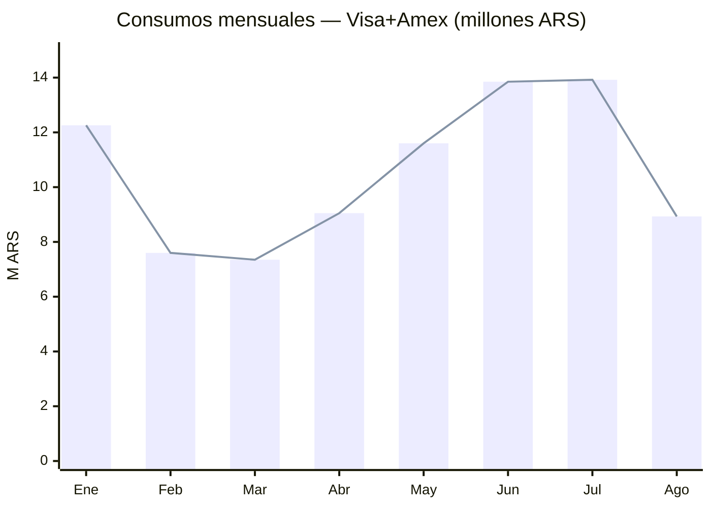
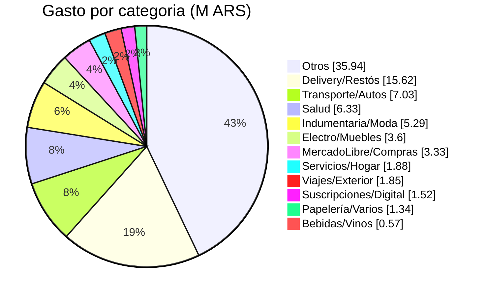
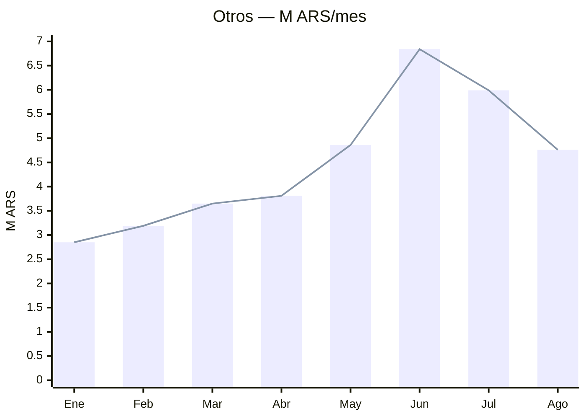
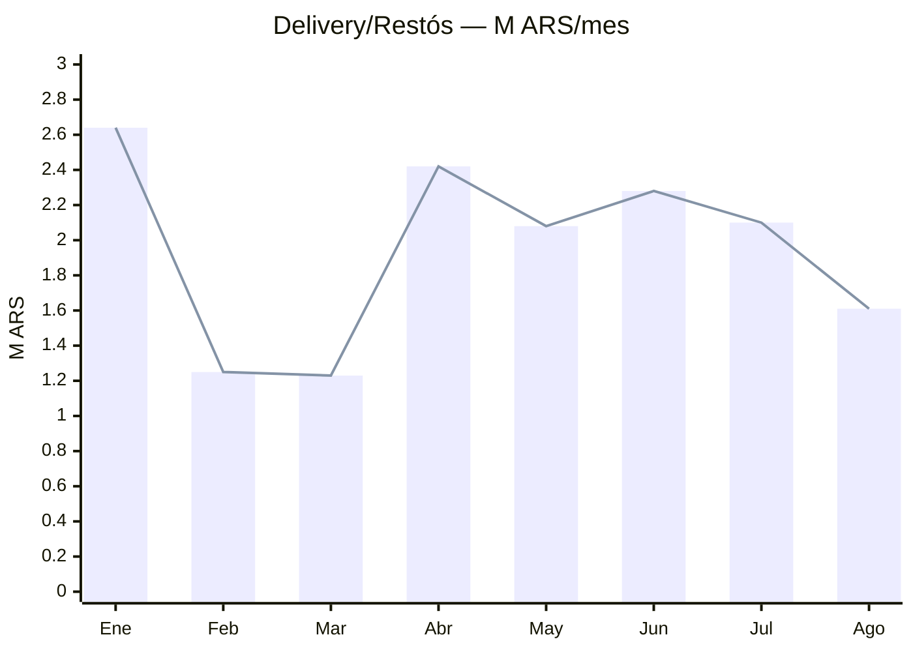
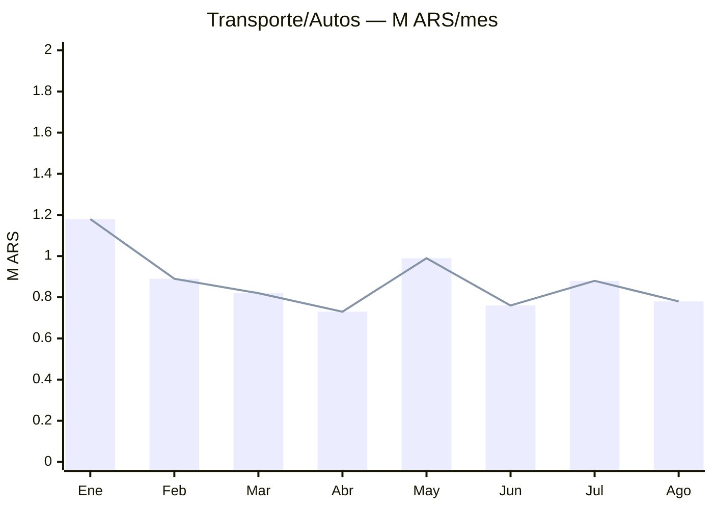
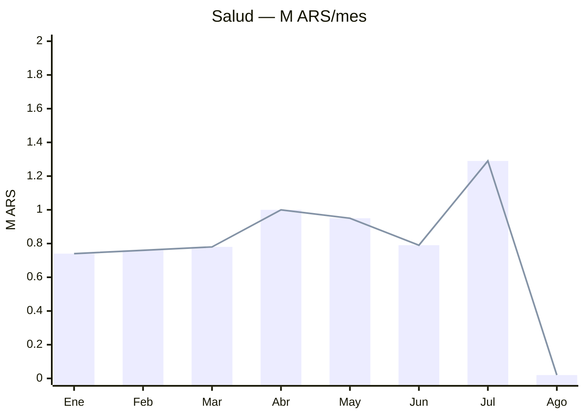
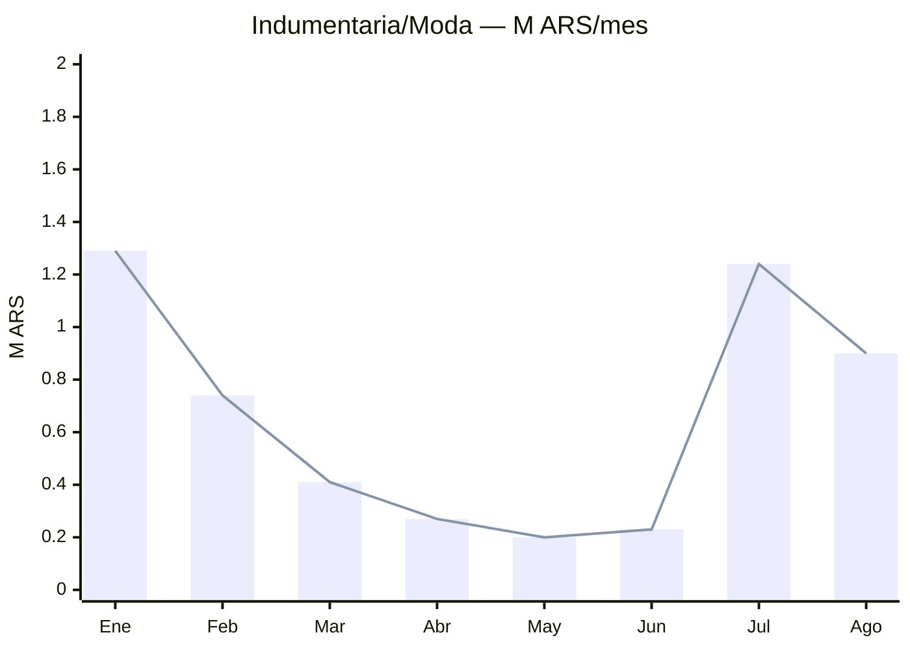
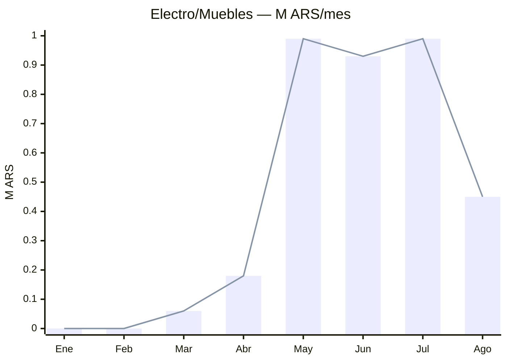

# 📊 Panorama de Gastos — Tarjetas Santander

> [[Tarjetas]] · [[Índice Resúmenes]] · [[Gastos por Comercio]] · [[Cuotas Activas]] · [[Pagos e Intereses]]

Período: **Ene–Ago 2026** (Visa + Amex). Montos como aparecen en cada resumen (cuotas = valor mensual).

## 🔴 Situación actual (último resumen — Agosto 2026)

| | Visa | Amex | **Total** |
|---|--:|--:|--:|
| Deuda total $ | 14.809.045,09 | 13.374.170,39 | **28.183.215,48** |
| Saldo financiado $ (genera interés) | 8.931.601,54 | 8.815.144,63 | **17.746.746,17** |
| Pago mínimo $ | 5.210.980,00 | 4.198.210,00 | **9.409.190,00** |
| Deuda U$S | 148,70 | 428,24 | **576,94** |
| TNA vigente | 77,900% | 77,900% | |

> **63% de la deuda está financiada** ($17.746.746,17) generando interés a ~78% TNA. Es la palanca #1 a atacar.

## 📈 Gasto mensual total

Gasto total 8 meses: **$84.561.177,99**. Promedio mensual: **$10.570.147,25**. Pico en **Jul ($13.921.637,80)**, mínimo en **Mar ($7.350.628,73)**.

### Visa vs Amex por mes (M ARS)

| Tarjeta | Ene | Feb | Mar | Abr | May | Jun | Jul | Ago |
|---|--:|--:|--:|--:|--:|--:|--:|--:|
| Visa | 5.98 | 3.89 | 4.27 | 5.66 | 8.22 | 7.74 | 7.12 | 5.2 |
| Amex | 6.28 | 3.71 | 3.08 | 3.39 | 3.38 | 6.11 | 6.81 | 3.74 |

## 🥧 Composición por categoría (total 8 meses)

| Categoría | Total $ | % |
|---|--:|--:|
| Otros | 35.939.299,74 | 42.6% |
| Delivery/Restós | 15.623.656,06 | 18.5% |
| Transporte/Autos | 7.030.670,21 | 8.3% |
| Salud | 6.333.687,97 | 7.5% |
| Indumentaria/Moda | 5.285.857,45 | 6.3% |
| Electro/Muebles | 3.603.511,85 | 4.3% |
| MercadoLibre/Compras | 3.328.538,23 | 3.9% |
| Servicios/Hogar | 1.876.527,17 | 2.2% |
| Viajes/Exterior | 1.848.927,00 | 2.2% |
| Suscripciones/Digital | 1.523.854,31 | 1.8% |
| Papelería/Varios | 1.337.446,06 | 1.6% |
| Bebidas/Vinos | 572.400,00 | 0.7% |
| **Total** | **84.304.376,05** | 100% |

## 📉 Cómo sube y baja cada categoría (M ARS por mes)

### Otros

### Delivery/Restós

### Transporte/Autos

### Salud

### Indumentaria/Moda

### Electro/Muebles

## 🧮 Matriz categoría × mes (M ARS)

| Categoría | Ene | Feb | Mar | Abr | May | Jun | Jul | Ago | Total |
|---|--:|--:|--:|--:|--:|--:|--:|--:|--:|
| Otros | 2.85 | 3.19 | 3.65 | 3.81 | 4.86 | 6.84 | 5.99 | 4.76 | **35.94** |
| Delivery/Restós | 2.64 | 1.25 | 1.23 | 2.42 | 2.08 | 2.28 | 2.1 | 1.61 | **15.62** |
| Transporte/Autos | 1.18 | 0.89 | 0.82 | 0.73 | 0.99 | 0.76 | 0.88 | 0.78 | **7.03** |
| Salud | 0.74 | 0.76 | 0.78 | 1.0 | 0.95 | 0.79 | 1.29 | 0.02 | **6.33** |
| Indumentaria/Moda | 1.29 | 0.74 | 0.41 | 0.27 | 0.2 | 0.23 | 1.24 | 0.9 | **5.29** |
| Electro/Muebles | 0.0 | 0.0 | 0.06 | 0.18 | 0.99 | 0.93 | 0.99 | 0.45 | **3.6** |
| MercadoLibre/Compras | 0.69 | 0.08 | 0.21 | 0.26 | 0.21 | 0.87 | 0.86 | 0.15 | **3.33** |
| Servicios/Hogar | 0.41 | 0.31 | 0.16 | 0.17 | 0.17 | 0.2 | 0.26 | 0.19 | **1.88** |
| Viajes/Exterior | 0.99 | 0.22 | 0.03 | 0.03 | 0.22 | 0.34 | 0.0 | 0.0 | **1.85** |
| Suscripciones/Digital | 0.12 | 0.12 | 0.12 | 0.12 | 0.92 | 0.04 | 0.04 | 0.04 | **1.52** |
| Papelería/Varios | 0.47 | 0.15 | 0.0 | 0.17 | 0.16 | 0.16 | 0.06 | 0.15 | **1.34** |
| Bebidas/Vinos | 0.0 | 0.0 | 0.0 | 0.0 | 0.0 | 0.57 | 0.0 | 0.0 | **0.57** |

## 💡 Lectura rápida

- **Delivery/Restós** es el gasto identificable #1: $15.623.656,06 en 8 meses (~$1.952.957,01/mes). Rappi + PedidosYa concentran la mayor parte.
- **Electro/Muebles** aparece de mayo en adelante (compras grandes en cuotas) — es lo que empuja el saldo financiado hacia arriba.
- **Viajes/Exterior** y **Suscripciones** son estacionales: pico en enero (viaje a Chile) y mayo.
- Casi la mitad del gasto cae en **'Otros'** (43%): son comercios que no pude clasificar automáticamente. Ver lista abajo para etiquetarlos.

### Grandes de 'Otros' sin clasificar

| Comercio | Total aprox $ |
|---|--:|
| GRANSASSOSRL | 3.840.000,00 |
| DAMIAN COLOMBO | 3.392.000,00 |
| ELLOKII | 3.014.983,25 |
| RESPAWN | 2.035.555,56 |
| CLICKSPORT | 990.000,00 |
| CASA PALANTI | 794.900,00 |
| NIKITA | 761.900,00 |
| GLORIAPRIMITIVABA | 738.231,00 |
| CASAHERMANA | 704.266,64 |
| PAJESMAYRA | 567.047,00 |
| JULIA RESTO | 500.000,00 |
| VETERINARIA DR CANTELLO | 474.000,00 |
| PENGUIN DOT BAIRES | 419.550,00 |
| POSTOBLANCO | 412.414,00 |
| RENAPER MS | 400.000,00 |
