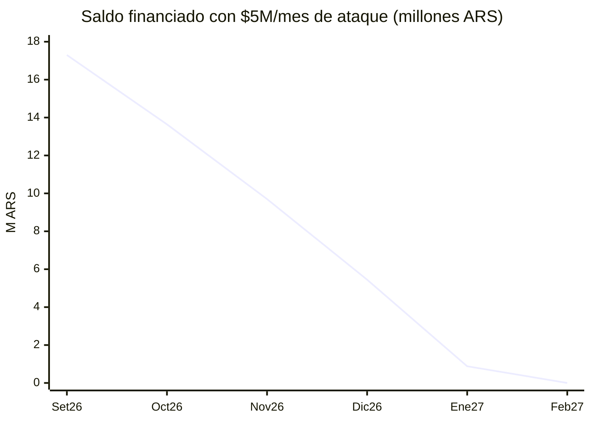

# 🎯 Proyección de Pago — Desarmar la deuda financiada

> [[Tarjetas]] · [[Panorama de Gastos]] · [[Pagos e Intereses]] · [[Cuotas Activas]] · [[Visa 2026-09]] · [[Amex 2026-09]]

## Punto de partida (03-09-2026, resúmenes Set/26 emitidos)

| | Visa | Amex | Total |
|---|--:|--:|--:|
| Saldo total del resumen | 14.689.557,63 | 13.995.697,52 | 28.685.255,15 |
| Pago hecho | -5.300.000,00 | pendiente (vto 07-Set) | — |
| **Saldo que se financia** | 9.389.557,63 | ~7.916.298,66 ¹ | **~17,3M** |

¹ Amex: saldo financiado del resumen anterior; el definitivo depende de cuánto pagues el 07-Set (mínimo $4.882.430).

Costo de cargar ~$17,3M: **TEM 6,411% + IVA 21% ≈ 7,76%/mes real ≈ $1,34M/mes** de interés+IVA (~$16M/año si no se baja).

## La cuenta que decide todo

> **Pagás − Consumís − Interés = cuánto BAJA la deuda**

Con presupuesto de **$10M/mes**, el resultado depende de a cuánto bajes los consumos (hoy ~$9,65M/mes entre las dos tarjetas):

| Consumos/mes | Ataque ($10M − consumos) | Resultado |
|---|--:|---|
| $9,65M (sin cambios) | ~$0,35M | ❌ < interés ($1,34M) → la deuda **crece** |
| $6,5M | ~$3,5M | ✅ salís en ~6–7 meses |
| **$5,0M** | **~$5,0M** | ✅ salís en **~5 meses** |
| $4,5M | ~$5,5M | ✅ salís en ~4 meses |

**$10M/mes alcanza para salir rápido, pero solo si cortás consumos.** Con consumos intactos, no salís nunca.

## Cronograma recomendado ($10M/mes · consumos ~$5M · ataque $5M)

Sobre ~$17,3M financiados, a 7,76%/mes (interés + IVA):

| Mes | Saldo inicial | Interés+IVA | A capital | Saldo final |
|---|--:|--:|--:|--:|
| Oct/26 | 17.300.000 | 1.341.961 | 3.658.039 | 13.641.961 |
| Nov/26 | 13.641.961 | 1.058.207 | 3.941.793 | 9.700.168 |
| Dic/26 | 9.700.168 | 752.442 | 4.247.558 | 5.452.610 |
| Ene/27 | 5.452.610 | 422.969 | 4.577.031 | 875.579 |
| Feb/27 | 875.579 | 67.918 | 875.579 | **0** |

**Financiado en $0 en ~5 meses (Feb/27).** Interés+IVA total pagado en el camino: **~$3,64M**.

## ⚠️ Reglas de oro

1. **Nunca solo el mínimo.** Cada mes pagá el **100% de los consumos nuevos** + el **ataque fijo** a la deuda vieja. Así nada nuevo entra a financiarse.
2. **Frená las compras en cuotas.** Venís sumando **+$299.888/mes** netos de planes nuevos ([[Cuotas Activas]]) — es el motor que infla la bola.
3. **Consumos en USD → pagalos en dólares** antes del vto: zafás la percepción del 30% (en la Amex son ~$210k/mes).
4. **No adelantes cuotas ya pactadas:** ya tienen el interés incluido, seguí el cronograma.
5. **Bajá el gasto diario a débito/efectivo** (Rappi, Uber, super, suscripciones): es lo que baja los consumos de ~$9,65M a ~$5M.

## Este mes (recordatorio)

- **Visa:** ✅ pagado $5.300.000 (03-Sep), por encima del mínimo.
- **Amex:** pagá **≥ $4.882.430 antes del 07-Set** (mejor más, para no engrosar el financiado). Traé la plata por la **ruta cripto barata** (Mercury → USDC → P2P, ~$1.570/USD) en vez de tarjeta.

---
*Supuestos: TEM 6,411% + IVA 21% ≈ 7,76%/mes constante; base financiada ~$17,3M; consumos nuevos pagados al 100%; ataque imputado a capital. Actualizado 03-09-2026 con los resúmenes Set/26 emitidos.*
