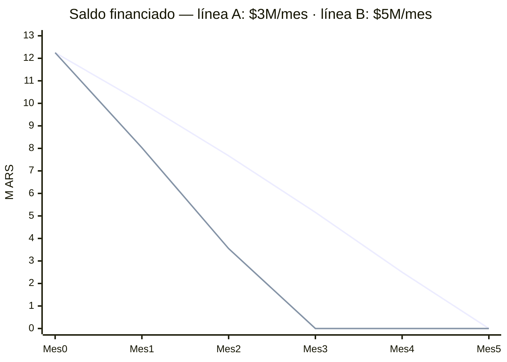

# 🎯 Proyección de Pago — Desarmar la deuda financiada

> [[Tarjetas]] · [[Panorama de Gastos]] · [[Pagos e Intereses]] · [[Cuotas Activas]]

## Punto de partida (hoy, 09-08-2026)

| | Visa | Amex | Total |
|---|--:|--:|--:|
| Saldo total | 14.809.045,09 | 13.374.170,39 | 28.183.215,48 |
| Pagos hechos | -5.500.000,00 | -1.000.000,00 | -6.500.000,00 |
| Saldo pendiente del resumen | 9.309.045,09 | 12.374.170,39 | 21.683.215,48 |
| **Financiado (paga interés)** | 3.431.601,54 | 8.815.144,63 | **12.246.746,17** |

> **Amex:** el pago parcial de **$1.000.000,00** (tarjeta ****-34375, 09-08-2026) se imputa al consumo nuevo del resumen (~$4,56M). Todavía **no toca** el financiado de $8.815.144,63. Para no sumar interés nuevo hay que cubrir el 100% del resumen ($12.374.170,39 restantes) antes del **vto 10-ago**.

El **saldo financiado** es la deuda cara: rinde **TEM 6.403% mensual (TNA 77,9%)**.
Sobre $12.246.746,17 eso es **$784.159,16 de interés por mes** ($9.409.909,89/año) si no lo bajás.

## ⚠️ Regla de oro: nunca pagar el mínimo

Cada mes hay **dos cosas distintas** que pagar:
1. **El resumen del mes** (consumos nuevos + cuotas del mes) → pagá el **100% del saldo**, no el mínimo. Así **nada nuevo** entra a financiarse.
2. **La deuda financiada vieja** ($12.246.746,17) → atacala con un pago **extra** fijo por mes.

Si pagás solo el mínimo, tirás **$784.159,16/mes** a intereses y la deuda casi no baja (o crece).

## 💰 Escenarios: cuánto extra/mes para matar los $12.246.746,17

| Pago extra/mes | Meses para saldar | Interés total que pagás | Total desembolsado |
|--:|:--:|--:|--:|
| 1.000.000,00 | 25 | 12.463.615,54 | 24.710.361,71 |
| 1.500.000,00 | 12 | 5.635.816,13 | 17.882.562,30 |
| 2.000.000,00 | 9 | 3.793.198,76 | 16.039.944,93 |
| 3.000.000,00 | 5 | 2.408.201,27 | 14.654.947,44 |
| 4.000.000,00 | 4 | 1.847.592,95 | 14.094.339,12 |
| 5.000.000,00 | 3 | 1.525.372,33 | 13.772.118,50 |
| 6.000.000,00 | 3 | 1.329.182,49 | 13.575.928,66 |

> A mayor pago, **menos interés total**. El salto grande está entre $1M y $2M/mes; de $5M a $6M casi no cambia (ambos ~3 meses).

## 📉 Cómo baja el saldo financiado (millones ARS)

- **Línea A ($3M/mes):** saldás en ~5 meses (Ene 2027), interés total ~$2,41M.
- **Línea B ($5M/mes):** saldás en ~3 meses (Nov 2026), interés total ~$1,53M.

## ✅ Recomendación

1. **Este mes:** pagá el **100%** del resumen de Amex (vence ~10-ago) para frenar que sume interés. Ya hiciste bien en meter $5,5M a Visa.
2. **Elegí un pago extra fijo** ($3–5M/mes es el rango eficiente) y sostenelo hasta llegar a $0 financiado.
3. **Frená compras nuevas en cuotas largas** hasta desarmar esto: cada compra en cuotas al 78–106% TNA vuelve a inflar el financiado (fue lo que pasó con muebles + tecno + joyería, ver [[Panorama de Gastos]]).
4. **Cuotas fijas ya pactadas** ([[Cuotas Activas]]): NO conviene adelantarlas, ya tienen el interés incluido; seguí el cronograma.
5. Objetivo realista: **financiado en $0 antes de fin de 2026**, ahorrando entre **$3,9M y $7,9M** de intereses vs. seguir pagando mínimos.

---
*Supuestos: TEM 6,403% constante; el pago extra se imputa 100% al saldo financiado; se paga el 100% del consumo nuevo cada mes. Si me decís tu tope real de pago mensual, ajusto el plan a fechas concretas.*